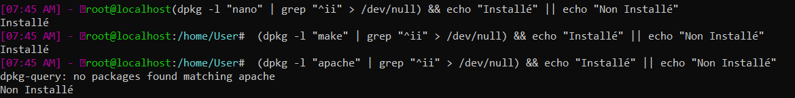

[](https://classroom.github.com/online_ide?assignment_repo_id=8701054&assignment_repo_type=AssignmentRepo)

[TP 4 :]{.ul}

# Table des matières {#table-des-matières .TOC-Heading}

[Exercice 1. Commandes de base : 2](#exercice-1.-commandes-de-base)

[Exercice 2 : Scripte d'origine d'une commande :
3](#exercice-2-scripte-dorigine-dune-commande)

[Exercice 3 : Commande de vérification d'installation :
3](#exercice-3-commande-de-vérification-dinstallation)

[Exercice 4 : Lister les programme d'un package :
3](#exercice-4-lister-les-programme-dun-package)

[Exercice 5 : Aptitude : 4](#exercice-5-aptitude)

[Exercice 6 : Installation d'un paquet par PPA
4](#exercice-6-installation-dun-paquet-par-ppa)

[Exercice 7 : Installation d'un logiciel à partir du code source
5](#exercice-7-installation-dun-logiciel-à-partir-du-code-source)

[Exercice 8 : Création de dépôt personnalisé :
7](#exercice-8-création-de-dépôt-personnalisé)

[Création d'un paquet Debian avec dpkg-deb :
7](#création-dun-paquet-debian-avec-dpkg-deb)

[Création du dépôt personnel avec reprepro :
7](#création-du-dépôt-personnel-avec-reprepro)

[Signature du dépôt avec GPG : 8](#signature-du-dépôt-avec-gpg)

# Exercice 1. Commandes de base :


[Question 1 :]{.ul} sudo apt update et sudo apt upgrade

[Question 2 :]{.ul} Il faut y renseigner alias **maj= sudo apt update -y
&& sudo apt upgrade**

[Question 3 :]{.ul} Grace à la commande **cat /var/log/dpkg.log \| tail
-5** , on obtient ces 5 paquets :


[Question 4 :]{.ul} Cela est possible avec la commande apt list
--installed

[Question 5 :]{.ul} Dpkg ne gère pas les dépendances et apt (1999) est
bien plus récent que dpkg (1993).

[Question 6 :]{.ul} Il y en a 68938 paquets sont disponibles en
téléchargement sur les dépôts Ubuntu

[Question 7 :]{.ul} Pour installer un paquet **sudo apt install
NOM_paquet**

-   Glances est un outil de surveillance multi-plateforme qui vise à
    présenter un grande quantité d\'informations de surveillance à
    travers une interface curses ou Web.

-   tldr est une abréviation très souvent utilisée sur Internet de Too
    long; didn\'t read qui exprime un texte trop long et propose donc un
    résumé. L\'utilitaire présenté dans cet article retient bien cette
    philosophie : aller à l\'essentiel.

-   Hollywood sert à simuler une fenêtre de hacking comme au cinéma, sur
    Ubuntu (ne sert à rien)

[Question 8 :]{.ul} Ce sont les paquets gnome-sudoku et ksudoku qui
proposent de jouer au sudoku.

# 

# Exercice 2 : Scripte d'origine d'une commande :


Ls provient du packet coreutils.

La commande pour obtenir le nom du packet d'origine d'une commande est
la suivante : which -a \$1 \| xargs dpkg -S 2\> /dev/null

# [Exercice 3 : Commande de vérification d'installation :]{.ul}

Pour répondre au besoin nous allons utiliser la commande suivante :

-   **(dpkg -l \"nom_du_packet\" \| grep \"\^ii\" \> /dev/null) && echo
    \"Installé\" \|\| echo \"Non Installé\"**



# Exercice 4 : Lister les programme d'un package :

Voici les programmes livrés avec coreutils, on peut les afficher grâce à
la commande : **dpkg -s coreutils**


# Exercice 5 : Aptitude :

Emacs: Emacs, ou Editor MACroS, créé par Richard Stallman est un éditeur
de texte très puissant, extensible et personnalisable.

Lynx: Lynx est un navigateurs web en mode texte utilisable via une
console ou un terminal. Distribué sous licence GNU GPL, il supporte
Gopher, HTTP, HTTPS, FTP, WAIS, NNTP et le SSL.

Pour utiliser aptitude, il nous faut tout d'abord l'installer :

-   **Sudo apt install aptitude**

Puis pour le lancer, nous allons utiliser la commande suivante :

-   **Sudo aptitude**


# Exercice 6 : Installation d'un paquet par PPA

1\) Installer la version Oracle de Java (avec l'ajout des PPA)

-   sudo add-apt-repository ppa:linuxuprising/java

-   sudo apt update

-   sudo apt install oracle-java17-installer

2\) Voici le fichier qui a été créé dans /etc/apt/sources.list.d :

# Exercice 7 : Installation d'un logiciel à partir du code source

1\) Nous avons cloner le dépôt git avec la commande suivante :


2\) Pour lire le README.md nous allons installer mdless ce qui nous
donne ce visuel :


3\) Avant d'installer cbonsai il faut plusieurs préalables :

-   sudo apt install libncursesw5-dev

```{=html}
<!-- -->
```
-   apt install scdoc

-   sudo apt install gcc make

-   sudo make install :

-   Pour utiliser le programme on tape la commande suivante :
    **cbonsai **

et voici le résultat :

-   

# Exercice 8 : Création de dépôt personnalisé :

## Création d'un paquet Debian avec dpkg-deb :

Le but de créer un dépôt personnalisé en locale est de pouvoir avoir un
package en locale pour éviter de prendre de la bande passante (même
principe que le serveur WSUS).


## Création du dépôt personnel avec reprepro :

Reprepro création d'un repository.

En informatique, un dépôt ou référentiel (de l\'anglais repository) est
un stockage centralisé et organisé de données. Ce peut être une ou
plusieurs bases de données où les fichiers sont localisés en vue de leur
distribution sur le réseau ou bien un endroit directement accessible aux
utilisateurs.


{width="4.583973097112861in"
height="0.3646347331583552in"} repo-cpe.list


Note : on remarque qu\'il y a une erreur lors de la mise à jour de
cosmic Release (depuis repo-cpe) car il n\'est pas signé. On la
corrigera avec GPG.

## Signature du dépôt avec GPG :

GPG est la version GNU du protocole PGP (Pretty Good Privacy), qui
permet d'échanger des données de manière sécurisée. Ce système repose
sur la notion de clés de chiffrement asymétriques (une clé publique et
une clé privée).

Le but de cette partie est de signer le repository pour garantir son
authenticité.


Passphrase = 123+aze


Après avoir ajouté notre clé publique à notre dépôt avec la commande :

gpg \--export -a \"Adrien\" \> public.key

On ajoute la clé à la liste des clés fiables connues par apt :


Félicitations ! La configuration est (enfin) terminée ! Vérifiez que
vous pouvez installer votre paquet comme n'importe quel autre paquet.
